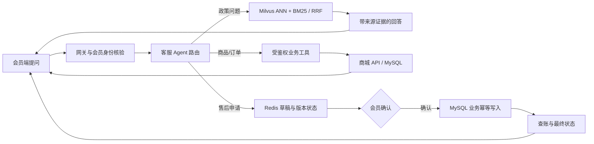

# 会员端智能客服：面试与课设答辩讲稿

> 口径：以当前代码与 `agent-upgrade-validation.md` 的 2026-10-03 验收记录为准。商城主体来自 mall 生态改造；面试时把个人贡献落在智能客服链路、会员端体验、可靠性、安全边界和评测取舍上。所有指标均注明测试范围，不外推为生产准确率。

## 30 秒版

我在一个 Spring Boot 电商项目上做了会员端智能客服，把传统后端里的登录身份、订单查询、售后业务和幂等处理接到了 Agent/RAG。会员可以在商城入口问政策、查商品和自己的订单；政策答案能回到来源原文，售后先生成草稿，会员核对后再确认。重点不是让模型直接做决定，而是把它放进可追溯、可鉴权、可恢复的业务流程里。RAG 用本地 Ollama、Milvus 与 BM25；149 条构造评测中，神经重排 MRR 只从 0.9283 到 0.9289，P95 却从 1040ms 到 1385ms，所以默认关闭。售后流程则用 Redis 状态版本控制和数据库幂等记录处理重复确认与结果不确定。

## 2 分钟版

项目是基于 mall 生态扩展的 Spring Boot 商城，会员端是我设计演示的主要入口。用户从商城进入客服或帮助中心，前者负责提问、查看实时商品信息和会员自己的订单，后者展示政策全文；客服引用可以回到帮助中心对应来源。这样答辩能从实际购物问题讲起，而不是先展示一堆 Agent 名词。

后端把请求分成两类：商品、政策问题走检索或公开查询；订单和售后操作必须从登录令牌核验会员身份，再校验订单归属。政策问答采用 Milvus ANN 与 BM25 双路检索、RRF 融合和特征重排，回答带来源信息。售后不是让 LLM 一步写库，而是先核对订单、检索政策并保存草稿；用户确认时，Redis CAS 抢占工作流状态，商城数据库用业务幂等键保护写入。出现超时或响应丢失时进入 `UNKNOWN`，先查操作记录，不盲目重试。

此前一轮在构造的 149 条查询、9 篇公开政策上做了对照。神经重排的 MRR 只有 +0.0006，P95 多 345ms，所以当时保留可选能力并默认关闭。后续增加了知识版本过滤及回归测试，没有重跑完整 149 条基准；所以这组结果是历史记录，不应说成当前修复版本的测量。当前也没有测量通用语义 faithfulness，因此不声称零幻觉。

开发过程中使用了 AI 协作，主要用于分析已有代码、比较方案、实现局部功能和排查测试失败。我给出的项目约束是会员端优先、沿用传统商城业务、本机 MySQL、控制资源开销，以及能在面试和答辩中用运行结果说明设计。面试时我会明确哪些方案和代码由 AI 辅助完成，再通过具体链路解释自己的理解与实际参与范围。

## 5 分钟版展开顺序

1. **用户问题。** 电商会员会问退换货时限、运费规则，也会查商品价格、库存、自己的订单；若要申请售后，系统需要把解释和真实写操作分开。
2. **系统结构。** UniApp 会员端经统一网关访问 Spring Boot 服务；会员令牌提供身份，商城 API 提供真实商品/订单数据，客服服务做 RAG、工具编排和工作流，Redis 保存会话工作流等状态，MySQL 保存商城数据及操作幂等记录。Ollama 在本机生成与向量化；Milvus 提供向量检索，Redis BM25 提供词项检索。Neo4j 是可选的局部政策主题关联。
3. **端到端过程。** 登录会员提问 → 服务端核验身份和访问级别 → 选择政策检索或业务工具 → 汇总证据/真实业务结果 → 返回回答、来源与可复核状态。售后额外经过“核对订单 → 持久草稿 → 用户确认 → 幂等执行 → 查询最终状态”。
4. **验证和取舍。** 前一轮 149 个构造用例、9 篇政策的 Recall@5=1.0 表示“指定来源被覆盖”，不是答案正确率；指定来源 precision 约 0.25，且替代来源标注不完整。神经重排收益极小但耗时更高，因此当时默认关闭。随后对版本过滤做了 13 项定向回归，但没有重跑整套 149 条评测。faithfulness 没测，图路径成功不代表一般多跳推理正确。
5. **AI 协作开发。** 说明给 AI 的业务目标和约束、如何拆分小任务，以及如何用编译、回归测试和真实接口检查生成结果。举一个有证据的例子：低收益神经重排默认关闭，或旧索引迁移边界通过回归测试修正。个人亲自完成的工作按实际分工说明。
6. **边界和下一步。** 这是工程集成与可靠性实践，不是新检索算法；商城主体不是我从零原创。后续应补充独立人工标注集、端到端语义/拒答评估、更多中断恢复场景和会员端实际使用反馈，再决定复杂组件是否开启。

## 我如何借助 AI 完成项目

### 一分钟口述

这个项目采用了 AI 协作开发。需求侧，我明确了几个约束：智能客服主要服务会员端，要接进已有商城的登录、商品、订单和售后体系；还要控制本机资源和开发额度，并留下能复现的答辩证据。AI 帮助分析仓库、提出方案、编写代码和测试，再分配边界清楚的小任务给低成本子 agent，例如会员端布局、接口适配和文档整理。

AI 输出之后，项目通过类型检查、编译、回归测试和真实接口联调来验收。比如神经重排有实际接入，但在当前评测集上收益很小、延迟更高，因此默认关闭；版本升级时发现旧政策索引可能进入新版候选，又补了过滤和回归测试。面试时，我会把 AI 辅助实现的范围说清楚，并用这些具体问题解释架构、验证方法和自己的实际参与，而不会把整个商城说成自己从零手写。

### 需求到验收的协作方法

| 环节 | 给 AI 的输入或任务 | 判断结果的依据 |
|---|---|---|
| 明确需求 | 会员客服的真实使用场景、已有后端、PC/手机布局、本机 MySQL 和资源约束 | 能否从会员入口完成政策咨询、商品查询、个人订单和售后准备 |
| 分析与设计 | 先定位现有身份、订单接口和检索链路，再给出接入方案及失败场景 | 是否复用既有业务规则；身份、授权、确认和写入是否有明确边界 |
| 拆分实现 | 为子 agent 指定文件范围、接口契约和交付检查，局部任务用低成本模型 | 是否发生文件冲突、接口不一致或未经授权的业务操作 |
| 验证修正 | 提供实际报错、日志、测试失败和浏览器现象，要求修复后复验 | 类型检查、Java 测试、真实接口和页面结果，不以“AI 说完成了”为依据 |
| 整理讲述 | 将架构、取舍、实验和限制整理成讲稿 | 能否解释机制、对应代码和测试范围；个人贡献是否符合实际 |

这张表是可复用的协作方法。现场讲个人经历时，要区分“我提出的需求”“AI 提出的方案”“AI 执行的验证”和“我亲自检查或实现的部分”。如果某个架构点来自 AI 建议，可以直接说“AI 给了这个方案，我结合实现和验证结果理解它的适用条件”；不要把 AI 执行的测试说成自己手动完成，也不要声称已经逐行审核全部代码。

### 三个可以展开的实例

**从构建失败进入项目约束。** 会员端旧版 vue-tsc 与现有 TypeScript 不兼容。修复更新了检查工具，并保留现有 UniApp 和 TypeScript 版本，随后通过类型检查和 H5 构建。这个例子可以说明：把实际报错和版本约束交给 AI，先确定故障所在，再验证改动是否影响项目，而不是一次升级全部依赖。它不代表已经验证所有小程序或原生端。

**从能运行进入版本正确性。** 旧知识数据没有版本，新导入政策带版本；两者同时存在时，帮助列表重复，旧记录也可能占用检索候选。UI 去重只能解决展示，后端还需要依据 revision registry 过滤旧记录。进一步检查发现，先把旧向量补成 `legacy:<hash>` 再过滤会绕过迁移边界，因此改为先过滤原始版本，再补全真正未迁移的旧证据，并用 13 项定向回归验证。这可以说明为什么 AI 辅助代码也要检查数据迁移、处理顺序和失败边界。

**从技术候选进入实测取舍。** 神经重排模型已接入，不是只在文档里列名字；但当前 149 条构造查询中，MRR 收益只有 0.0006，P95 增加 345ms，因此默认关闭。可讲清楚“提出候选 → 做对照 → 根据结果保留开关”的过程，不能据此声称神经重排在所有场景都没有价值。

### 如何控制 AI 使用成本

开发阶段把布局、接口适配、文档和窄范围修复拆开，给子 agent 足够的上下文、明确的文件范围和验收条件，边界清楚的任务优先用低成本模型。涉及鉴权、并发和跨服务结果不确定的问题，需要额外检查和回归，不能只以模型便宜为选型依据。本项目没有做开发模型成本对照实验，因此不报告节省了多少比例。

运行阶段默认使用本机 Ollama，并通过查询路由、答案缓存和模型调用预算减少不必要的生成。商品价格、库存和订单以业务接口结果为准；检索评测可以把生成模型预算设为 0。开发用的子 agent 与商城运行时的客服 Agent 是两种不同角色，不要混为一谈。本地推理仍消耗算力、内存和时间。

## 我如何设计架构以及为什么这样设计

### 先从业务和失败场景确定边界

可以这样讲：我先把会员请求按它依赖的事实和可能产生的副作用拆开。政策问答依赖有版本的文档；商品、库存和个人订单依赖商城实时数据；售后申请还会产生持久写入。这三类请求分别需要证据检索、受鉴权业务工具和可恢复的确认流程，不能只设计成一条统一的“提问 → 模型回答”链路。

由此形成几个设计约束：模型可以理解意图和组织回答，但会员身份必须由服务端核验；订单归属和写入规则继续由商城控制；政策解释要能回到当时的原文；请求超时时要能查询结果，而不是直接再写一次。这些约束决定了服务边界和数据存放位置，具体组件则结合现有代码与验收结果选择。

### 两分钟架构口述

整体沿用商城已有的模块边界：会员端经过网关进入客服服务，客服负责对话、检索和工具编排，商品和订单仍由原商城 API 提供。这样不用另造一套订单逻辑，也不用让模型直接访问数据库。涉及会员数据时，客服从令牌解析并核验身份，商城接口继续检查订单归属。

政策属于相对稳定但会改版的文本，用 RAG 提供回答证据。Milvus 支持语义近邻，BM25 补充关键词匹配；检索根据查询选择路径，双路时用 RRF 合并排名，避免直接相加不同尺度的分数。回答带来源和版本，缓存随知识发布变化失效。价格和库存变化快，直接查商城，不把旧商品文本当作实时事实。

售后拆成准备、确认和执行。Redis 保存草稿与状态版本，用 CAS 控制同一任务的并发推进；MySQL 在商城写入事务中保存幂等操作记录，处理业务请求重放。若写入调用结果不确定，就进入 UNKNOWN 并查操作记录。Redis 控制谁推进流程，MySQL 记录业务到底做没做，这样才能处理重试和响应丢失。

部署上，本机 MySQL 管商城业务，Docker 只运行有依赖的中间件，其他服务按需启用。这个项目展示的是传统后端如何接入模型能力和可靠性机制；当前模块划分不等于已经验证了大规模微服务治理或生产高可用。

### 关键选择与代价

| 设计问题 | 当前选择与原因 | 代价或适用边界 |
|---|---|---|
| Agent 接在哪里 | 独立客服服务经受鉴权工具调用现有商城 API，复用订单与售后规则 | 跨服务会出现超时和响应丢失，需要明确结果查询与幂等契约 |
| 哪些事实进入 RAG | 政策与 FAQ 作为文本证据；价格、库存、个人订单查实时业务接口 | 检索和工具返回都需要来源约束，RAG 本身不保证回答正确 |
| 为什么有语义与关键词检索 | 语义检索支持改写问法，关键词检索补充明确词项；adaptive 路由按查询选择，双路用 RRF | 两套索引增加维护与版本一致性成本，具体收益要在数据上验证 |
| 为什么保存政策版本 | 回答引用需要复核历史原文，未来生效规则不能提前作为当前政策 | 需要版本过滤、发布状态和缓存失效；旧数据迁移也要有边界 |
| 为什么不直接提交售后 | 先生成可核对草稿，再由会员确认，服务端执行业务规则 | 比一步操作多一次交互，但能明确用户意愿并保留恢复入口 |
| 为什么 Redis 与 MySQL 都管状态 | Redis 草稿/CAS 管流程竞争，MySQL 幂等记录与事务管实际业务结果 | 不承诺跨系统 exactly-once，也没有把 UNKNOWN 简化成“失败后重试” |
| 为什么神经重排默认关闭 | 在当前小型政策评测里收益小、延迟更高，保留开关方便后续复评 | 当前结论只适用于该构造数据集，复杂查询仍需另测 |
| 为什么本机模型和按需容器 | 满足课设现场推理、资源和本机 MySQL 约束，减少常驻服务 | 受本机硬件与模型冷启动影响；不能称为零资源成本或已实现高可用 |

### 怎样证明自己理解这套设计

面试前选两条链路练习画图并指到实现：一条是“令牌 → 会员身份 → 订单归属 → 工具结果”，另一条是“草稿版本 → CAS 确认 → 商城幂等写入 → UNKNOWN 查账”。再说明政策发布后，为什么旧索引不能继续参与当前检索，但旧回答仍需要按版本取原文。能解释正常路径、失败路径和验证证据，比背组件名字更有说服力。

## 可以讲深的 5 个故事

### 1. 业务操作幂等，不等于 Redis 的“一次性 token”

重复点击、并发确认、HTTP 超时和写入成功但响应丢失，都会让客户端不知道是否该重试。Redis 中的任务状态和 CAS 用来让同一草稿只有一个确认者推进；跨服务的商城写操作还需要持久业务幂等键/指纹和操作记录。两者解决不同层次的问题：前者管工作流竞争，后者管实际业务写入重放。重复请求回放既有结果；若调用结果不确定就查账，不能把 Redis 锁说成“端到端 exactly once”。实测中真实 MySQL 后端的隔离订单由独立客服 JVM 恢复，两个并发确认得到一份 `COMPLETED`、一份 `CONFLICT`，重复确认返回已有结果。

### 2. 持久草稿、CAS 与 UNKNOWN

售后草稿保存在 Redis，包含会员 owner、订单快照、理由、政策回答、操作 ID 和版本，TTL 为 7 天。确认要求匹配预期版本并原子推进状态；客服进程新实例能恢复草稿。外部写接口超时无法证明商城没写成功，因此状态进入 `UNKNOWN`，后续先按操作 ID 查账。验收覆盖新服务实例恢复、并发确认和响应丢失查账；它不是操作系统层面强杀进程的崩溃恢复测试。

### 3. RAG 策略不是越复杂越好

此前 149 条构造问题、9 篇政策的无生成检索对照中，两种配置 Recall@5 都是 1.0（只表示指定来源覆盖）。规则特征链路 MRR 0.9283、P95 1040ms；Qwen 神经重排 MRR 0.9289、P95 1385ms。提升 0.0006 且延迟增加，所以当时保留可选开关并默认关闭。此后补了版本过滤；这组数字没有在新代码上重跑，只能作为前一轮取舍依据，不能标为当前修复版本的指标。precision@5 约 0.25 的标注名单不完整，存在可接受的替代政策来源；不能把它直接说成最终相关性精度。下一步应在更难的长文、难负例和人工标注数据上复评。

### 4. 政策版本、缓存和历史引用一致性

政策不是永远覆盖成“当前文本”：系统需要区分当前有效版本、未来生效版本和历史引用。缓存按知识 epoch 失效，发布变化后不应继续用旧缓存冒充新政策；旧回答引用则需仍能按版本取回当时原文。验收验证了未来政策在生效前保持旧版本、生效后切换，且旧引用仍可读旧原文。讲这部分时强调它是内容生命周期和可复核性，不要把它说成模型能力。

### 5. 身份与决策权

LLM 可以解析意图或建议工具，但不负责认定用户是谁、是否拥有订单、是否同意提交。会员身份来自已核验令牌，工具按访问级别授权，订单工具再次校验归属；售后写入必须有明确确认。用户请求体里的 `userId` 不能替代身份。照片模型只整理可见观察并要求人工复核，不决定责任或退款资格。

## 追问与诚实答法

| 追问 | 建议回答 |
|---|---|
| 这是你独立做的商城吗？ | 不是。商城核心来自 mall 生态，我的重点贡献是智能客服接入、会员端对话/帮助体验，以及围绕身份、证据和售后确认的工程闭环。具体贡献范围以我实际提交和负责的模块为准。 |
| 项目用了 AI，那你做了什么？ | 我明确了会员端场景、传统后端接入、本机 MySQL 和成本约束，借助 AI 做方案与实现。具体编码、评审和验收参与范围按实际说明；我会用鉴权、售后确认和政策版本这几条链路展示自己的理解，而不把 AI 写的代码说成全部由我手写。 |
| AI 给的代码你怎么判断对不对？ | 看它是否满足接口、身份、并发和版本约束，再用构建、回归测试和真实接口验证。比如页面去重没有解决旧索引召回，必须继续检查后端过滤；先补 legacy 版本再过滤也存在边界问题，因此增加了针对处理顺序的测试。测试通过仍不代表所有场景都正确。 |
| 不用 AI，你能不能做？ | 这道题要按自己的能力回答。面试前应能独立解释两条核心链路，并练习一个小改动，例如添加只读工具的鉴权或补一个版本过滤回归。能做到就说明核心流程能逐步实现，陌生库细节会查文档；尚未掌握的部分如实说明，不做全栈能力的绝对承诺。 |
| 这个架构是你想出来的吗？ | 架构沿用了已有商城的业务边界，部分接入与可靠性方案来自 AI 建议和既有工程实践。我会区分亲自提出、共同讨论和参考的部分；重点解释为什么业务事实走商城 API、政策走版本化 RAG，以及售后为什么要有确认和查账。 |
| 为什么不让一个 Agent 直接查库并完成所有操作？ | 查询与写入的权限、订单归属和事务规则已经在商城服务里，应继续由这些规则控制。客服负责理解和编排，受鉴权工具提供业务结果；售后额外通过会员确认和幂等执行，减少模型输出直接产生写入的风险。 |
| 你如何节省 AI 成本？ | 开发任务按文件与验收条件拆小，局部工作优先用低成本子 agent；运行时默认本机模型，业务事实走接口，并使用缓存和模型预算。没有开发成本对照数据，所以不说节省了固定比例；本地算力成本也仍然存在。 |
| RAG 准确率是多少？ | 目前没有可诚实报告的端到端答案准确率或 faithfulness。149 条是开发者构造的检索评测，Recall@5=1.0 表示指定来源覆盖；知识来源标注不完整，不能等同答案正确。 |
| 为什么用了 ANN、BM25、RRF、reranker 和图？ | 它们是可组合的检索/召回能力，不是越多越好。当前神经重排收益小、P95 增加，因此默认关；图只补充固定政策主题的局部关联，回答证据仍来自政策正文。 |
| 这是完整 GraphRAG 吗？ | 不是。Neo4j 只做少量共享政策主题的局部关联，不是 Microsoft GraphRAG 的完整实体提取、社区摘要和全局问答流程。 |
| Agent 怎么防止越权？ | 服务端用会员令牌解析身份，工具注册表按访问级别控制，并在订单读取/售后准备时检查归属。LLM 提供意图和参数候选，不能授予权限。 |
| 重复确认会不会重复退款/售后？ | Redis CAS 管同一草稿竞争，商城数据库的操作幂等记录管业务重放；结果不明确进入 UNKNOWN 后查询操作记录。这里不承诺分布式 exactly-once。 |
| MCP 是不是 Spring AI 2 的完整能力？ | 不是。项目保留 Spring AI 1.0，自实现 2025-06-18 无状态 JSON-only Streamable HTTP 子集，并用官方 Python SDK 做互通验证；不支持 session、GET SSE、resources/prompts 等完整能力。 |
| 图像售后判断准确率如何？ | 没有测量。Qwen3-VL 只辅助描述图片可见内容并生成待复核草稿；27.4 秒来自一次合成图片传输/接口测试，不能解释为识别准确率。 |
| 本地模型是不是零成本？ | 没有付费推理 API、演示不依赖云端推理密钥；但本机仍消耗 CPU/GPU、内存和电力，不能称零资源成本。 |
| 为什么不用更多 Docker 容器？ | Windows 本机 MySQL 是主要业务数据库，Docker Compose 用来承载项目需要的基础设施中间件。演示只启动当前路径需要的服务；具体哪些服务可关闭，应按脚本依赖和演示场景检查后决定。 |

## 可复现的会员端答辩路径

1. 准备本机 MySQL（README 当前写作 MySQL 9.7）、JDK 21、Node 20 和所需本地模型；Docker 只启动演示链路实际依赖的中间件。检查本机 Ollama 已加载 `qwen3.5-noVL` 与 `bge-m3`，并确认知识状态不是空库。
2. 启动演示后打开会员商城端，从首页进入“智能客服”或“帮助中心”。会员端客服展示在线状态、模型与检索链路、知识篇数，并提供来源卡片查看原文；帮助中心可以展开政策原文并跳回提问。访客可以问政策和公开商品问题，登录后才使用订单与售后功能。客服引用能按版本查看原文，调试信息默认折叠。
3. 先问一个具体政策问题（例如“签收后多久可以申请退货？”），展开来源卡片，说明政策正文是依据。再问商品价格/库存类问题，说明实时值来自商城接口而非模型记忆。
4. 使用隔离演示会员登录后，查询该会员自己的订单；强调身份来自令牌与服务端订单归属校验。不要用请求体里的会员 ID 作为身份依据。
5. 售后只在隔离测试订单演示：准备草稿、核对订单快照和政策后明确确认；重复点击或遇到 UNKNOWN 时展示状态查询，不盲重试。普通演示/默认验证不要写共享或真实业务数据。

本轮已确认 Windows `MySQL97` 服务运行，商城连接本机 3306，演示会员登录与个人订单读取成功；原有数据库未重置。前一轮涉及并发确认和幂等写入的隔离测试环境为 MySQL 8，不能把两种环境的测试范围混为一谈。149 条评测不是前端实时跑的准确率面板。

会员端 H5 包含共享顶部导航、首页多列商品/品牌网格、分类侧栏与商品网格、帮助页双栏和客服聊天/业务侧栏；“我的”页重排为会员资料、订单与快捷入口卡片。已在 1280×720 和 390×844 浏览器验收首页与客服，宽屏输入区在首屏可见，手机隐藏桌面导航、保留首页 tabBar，两种尺寸均无横向溢出。轮播图加载失败有本地绘制的选购引导兜底。售后验证了生成草稿、刷新恢复和拒绝，未确认真实业务写入；订单摘要显示用户所需字段，不展示内部 JSON。图片只给原因建议并要求人工核实。

布局截图：[桌面首页](assets/member-pc-home.png)、[桌面客服](assets/member-pc-customer.png)、[手机客服](assets/member-mobile-customer.png)。Docker 默认保留 Redis、Mongo、Milvus、etcd、MinIO、Neo4j，其余中间件按 profile 开启；5 个闲置容器及对应卷已先归档再移除。详见 [Docker 资源与清理记录](docker-footprint.md)。

## 项目定位、贡献与创新边界

- **定位：**传统 Java 后端商城 + Agent 的工程集成课设。核心展示后端如何把模型能力接进已有用户、订单、知识和权限体系。
- **个人贡献：**按自己能举证的代码与交付填写。可重点讲会员端客服入口与引用体验、客服 RAG/工具编排、安全边界、可恢复售后确认、评测设计与组件取舍。不要把上游 mall 的商品、订单、用户基础模块全部说成原创。
- **创新类型：**工程创新与系统设计实践：可复核来源、权限约束、幂等执行、状态恢复、版本缓存一致性和按指标关闭收益不足的组件。没有提出新的向量检索或 reranking 算法。
- **MCP 边界：**自实现的是固定版本无状态 JSON-only 子集，和官方 Python SDK 做互通；不要说“完整 MCP 支持”或“Spring AI 2 已集成”。
- **Graph 边界：**共享政策主题上的局部 Neo4j 关联，不是完整 Microsoft GraphRAG。
- **视觉边界：**Qwen3-VL 只提供人工复核辅助，不做责任/资格决定；合成图片约 27.4 秒只验证调用链路。
- **资源边界：**不调用付费推理 API不等于没有本机算力消耗。MySQL 在 Windows 本机运行；Docker 仅用于所需基础服务，减少常驻容器要以依赖清单核对为前提。

## 仍需答辩人补齐的个人信息

把以下内容按实际情况补成一句话，再用于“个人贡献”追问：本人负责的具体模块/提交范围；哪些需求由本人提出、哪些方案来自 AI；亲自阅读、修改或验证过的代码和问题；课设中的团队人数及分工；现场电脑可以稳定启动的服务清单；演示会员/测试订单是否已准备。当前环境的验收结果在前文有记录，但不等于个人已经独立掌握全部实现。
